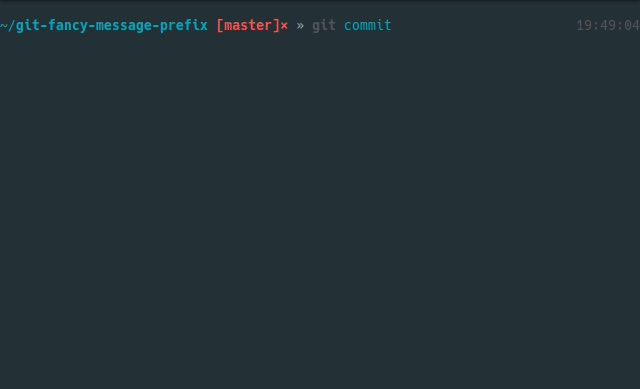
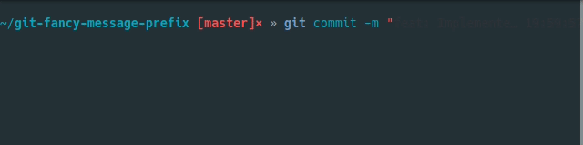

# Git Fancy Message Prefix

A Git prepare-commit-msg hook for fancy commit message

Inspired by:

- [Angular Commit Message Conventions](https://github.com/angular/angular.js/blob/v1.7.2/DEVELOPERS.md#type)
- [Git Commit message Emoji · GitHub](https://gist.github.com/parmentf/035de27d6ed1dce0b36a)

## Feature

### Commit message template



### Add an emoji to prefix of commit message automatically



## Install

Run following command in your git working directory

**bash**
```bash
curl https://raw.githubusercontent.com/negokaz/git-fancy-message-prefix/master/prepare-commit-msg.en -o .git/hooks/prepare-commit-msg && chmod +x .git/hooks/prepare-commit-msg
```

**fish**
```fish
curl https://raw.githubusercontent.com/negokaz/git-fancy-message-prefix/master/prepare-commit-msg.en -o .git/hooks/prepare-commit-msg; and chmod +x .git/hooks/prepare-commit-msg
```

## Customize

You can add original prefix and emoji by adding an entry to `templates` function.

```bash
# .git/hooks/prepare-commit-msg

function templates {
# format:
#
#   prefix:   emoji(code)   description
#
# Full Emoji List: https://unicode.org/emoji/charts/full-emoji-list.html
cat <<EOF
fizz:     \U1f600   This is an original prefix
feat:     \U2728    A new feature
fix:      \U1f41e   A bug fix
...
EOF
}
```